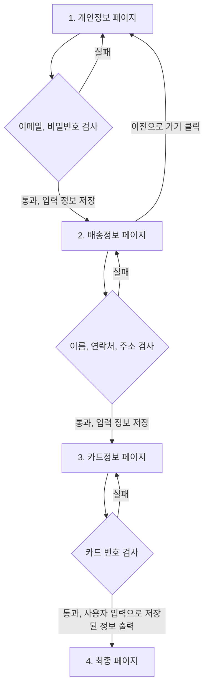

# BALAAN FE 주니어 사전과제

## 작성자 정보
```
작성자: 내연경
메일 주소: yeunk0206@gmail.com
```

### 화면 이동 및 데이터 전달 설계 


### 파일구조
```
~balaan_front_test\src
├── App.vue  --> 최종 출력되는 App 화면
├── components  --> 컴포넌트 디렉토리
|  ├── MyInput  --> 인풋 컴포넌트
|  |  └── MyInput.vue
|  └── veiw  --> 화면 단위 컴포넌트
|     └── memberRegister  --> 화면 단위(회원등록) 디렉토리명
|        ├── MemberInfo.vue --> 회원 등록 1단계 (개인 정보)
|        ├── DeliveryInfo.vue --> 회원 등록 2단계 (배송 정보)
|        ├── CreditCardReginum.vue --> 회원 등록 3단계 (카드 번호)
|        └── onSuccess.vue --> 회원등록 최종 성공시 화면
├── main.js
└── utils
```

### 배운 점
- Vue.js 작업을 처음 해보면서 데이터의 전달 방식, 흐름을 알 수 있었다.
- Vue는 코드 컨벤션을 따로 정할 필요 없이 정해진 문법이 있기 때문에 React 보다 협업하기 좋을것 같다.

### 아쉬웠던 점
- 지금은 <script>안에서 data와 method, computed로 데이터가 실시간으로 변경되도록 만들었는데 다음에는 composition api를 이용해서 react처럼 state와 해당 state를 변경하는 setter를 같이 묶어서 표현해보고 싶다,
- Vue에서 전역 변수를 다루는 방법을 좀 더 배우고 싶다.
- vue-router로 라우팅 구현을 해보고 싶다.

### 개발 서버 확인 명령어
```
yarn serve
```
